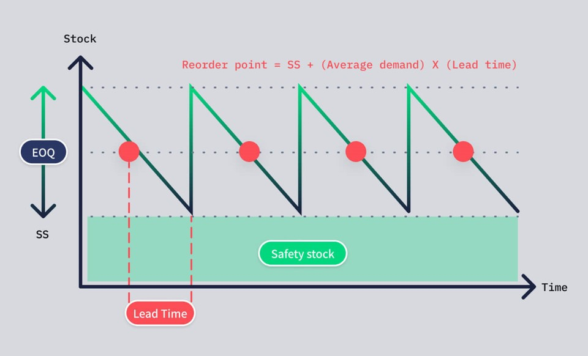

# **Data-Driven Inventory Management: Optimizing Spare Parts with 9-Box Analysis, EOQ, and Safety Stock**

## **Introduction**

In manufacturing and maintenance operations, spare parts management is often the unsung hero of operational efficiency. Stock too little, and you risk costly downtime. Stock too much, and you tie up capital in inventory that sits idle on shelves. The key lies in finding the sweet spot through proven inventory optimization techniques.

In this article, I'll walk you through the essential formulas and practical implementation of three critical inventory management concepts: **Economic Order Quantity (EOQ)**, **Safety Stock**, and **Reorder Points**. We'll move beyond theory with a real-world example and show you how to automate these calculations in your operations.

---

## **Understanding the Inventory Cycle**

Before diving into formulas, let's visualize how inventory flows:

![Inventory Management Cycle - showing EOQ, Safety Stock, Lead Time, and Reorder Point]

**Key Components:**

- **Stock Level**: Current inventory quantity that depletes over time due to usage
- **EOQ (Economic Order Quantity)**: The optimal order size that minimizes total inventory costs
- **Safety Stock (SS)**: Buffer inventory maintained to prevent stockouts during demand variability
- **Lead Time**: Time gap between placing an order and receiving the stock
- **Reorder Point**: The inventory level that triggers a new purchase order

---

## **The 9-Box Analysis: Smart Classification for Spare Parts**

Before we calculate optimal inventory levels, we need to understand that **not all spare parts are created equal**. The 9-box matrix is a powerful classification framework that combines two critical dimensions:

### **Understanding the Two Dimensions**

**1. ABC Analysis (Value Dimension) - Pareto Principle**

ABC classification uses historical consumption value to identify which parts drive the most financial impact:

- **A-Class Parts**: Top 75% of cumulative inventory value (high-value, high-impact)
- **B-Class Parts**: 75-95% of cumulative inventory value (medium-value)
- **C-Class Parts**: Bottom 5% of cumulative inventory value (low-value, many SKUs)

**Calculation Method:**
1. Calculate total consumption value per part: `Total Value = Σ(Quantity × Unit Price)` over analysis period
2. Sort parts by total value in descending order
3. Calculate cumulative percentage of total value
4. Assign categories based on cumulative thresholds

**2. LMH Analysis (Demand Variability Dimension) - VOD Method**

LMH classification uses **VOD (Variance of Demand)**, also known as the Coefficient of Variation, to measure demand predictability:

\[ \text{VOD} = \frac{\text{Standard Deviation of Monthly Demand}}{\text{Average Monthly Demand}} \]

- **L (Low Variability)**: VOD ≤ 1.0 - Stable, predictable demand
- **M (Medium Variability)**: 1.0 < VOD ≤ 2.0 - Moderate fluctuations
- **H (High Variability)**: VOD > 2.0 - Erratic, unpredictable demand

**Why VOD Matters:**
- Low VOD (L) = Predictable demand = Lower safety stock needed
- High VOD (H) = Erratic demand = Higher safety stock needed to prevent stockouts

### **The 9-Box Matrix**

Combining these dimensions creates a 3x3 grid:

| **Demand Variability →** <br> **Value ↓** | **L (Low) - Stable** | **M (Medium)** | **H (High) - Erratic** |
|---|---|---|---|
| **A (High Value)** | AL | **AM** | **AH** |
| **B (Medium Value)** | **BL** | **BM** | **BH** |
| **C (Low Value)** | **CL** | **CM** | CH |

**Reading the Matrix:**
- **Left columns (L)** = Most predictable demand, easier to manage
- **Middle columns (M)** = Moderate demand fluctuations  
- **Right columns (H)** = Erratic demand, hardest to forecast

### **How 9-Box Analysis Drives Service Levels**

Different part classifications demand different service levels and safety stock strategies. Here's how to set your Z-scores (safety factors) based on the 9-box classification:

#### **Tier 1: High-Value Stable/Moderate A-Class Parts**
**Part Classes: AL, AM** (A-class with stable or moderate demand variability)
- **Service Level**: 99% (Z = 2.33)
- **Rationale**: High value + predictable demand = maximum availability investment
- **Strategy**: Premium safety stock for best-case A-parts

```python
if nine_box in ['AL', 'AM']:
    service_level = 0.99  # Z = 2.33
    safety_stock = 2.33 × σ × √Lead_Time
```

#### **Tier 2: Medium-Value Stable/Moderate B-Class Parts**
**Part Classes: BL, BM** (B-class with stable or moderate demand variability)
- **Service Level**: 97% (Z = 1.88)
- **Rationale**: Moderate value + predictable demand = strong availability
- **Strategy**: High availability with balanced investment

```python
elif nine_box in ['BL', 'BM']:
    service_level = 0.97  # Z = 1.88
    safety_stock = 1.88 × σ × √Lead_Time
```

#### **Tier 3: Mixed Priority Parts**
**Part Classes: CL, CM, AH, BH** (Low-value stable/moderate OR high-value/medium-value with erratic demand)
- **Service Level**: 95% (Z = 1.64)
- **Rationale**: Either low-value predictable parts OR higher-value parts with erratic demand that's costly to buffer
- **Strategy**: Good availability but conservative on high-variability parts

```python
elif nine_box in ['CL', 'CM', 'AH', 'BH']:
    service_level = 0.95  # Z = 1.64
    safety_stock = 1.64 × σ × √Lead_Time
```

#### **Tier 4: Low-Value, Erratic C-Class Parts**
**Part Classes: CH and unclassified** (C-class with high variability)
- **Service Level**: 90% (Z = 1.28)
- **Rationale**: Low value + unpredictable demand = higher risk acceptable
- **Strategy**: Minimal investment, accept stockout risk, order on demand

```python
else:  # CH and unclassified
    service_level = 0.90  # Z = 1.28
    safety_stock = 1.28 × σ × √Lead_Time
```

**Key Insights:** 
- **AL & AM** get the highest service level (99%) - these are high-value parts with predictable demand, the "sweet spot"
- **AH & BH** are downgraded to 95% despite being high/medium value because erratic demand makes high safety stock too costly
- **Demand variability matters**: Compare AH (95%) vs AL (99%) - same value class, but variability changes the strategy

### **Practical Application: Classifying Your Parts**

**Step 1: ABC Classification (Pareto Analysis on Consumption Value)**

```python
# Calculate total consumption value per part (over 36 months)
part_value = sales_df.groupby('PartNum').agg({
    'TotalValue': 'sum'  # TotalValue = Quantity × Unit Price
}).reset_index()

# Sort by value descending
part_value = part_value.sort_values(by='TotalValue', ascending=False)

# Calculate cumulative percentage
part_value['CumulativeValue'] = part_value['TotalValue'].cumsum()
total_value = part_value['TotalValue'].sum()
part_value['CumulativePercentage'] = 100 * part_value['CumulativeValue'] / total_value

# Assign ABC categories
def categorize_abc(cumulative_pct):
    if cumulative_pct <= 75:
        return 'A'
    elif cumulative_pct <= 95:
        return 'B'
    else:
        return 'C'

part_value['Category'] = part_value['CumulativePercentage'].apply(categorize_abc)
```

**Step 2: LMH Classification (VOD Calculation over 36 Months)**

```python
# Prepare monthly demand data for last 36 months
df['Month'] = df['TransactionDate'].dt.to_period('M')

# Create pivot with all 36 months (fill missing months with 0)
pivot_df = df.pivot_table(
    index='PartNum', 
    columns='Month', 
    values='TotalDemand',
    aggfunc='sum'
).fillna(0)

# Calculate statistics
pivot_df['std'] = pivot_df.iloc[:, :36].std(axis=1)
pivot_df['avg_usage'] = pivot_df.iloc[:, :36].mean(axis=1)

# Calculate VOD (Coefficient of Variation)
pivot_df['vod'] = pivot_df['std'] / pivot_df['avg_usage']

# Assign LMH categories based on VOD thresholds
def categorize_lmh(vod):
    if vod <= 1.0:
        return 'L'  # Low variability (stable)
    elif vod <= 2.0:
        return 'M'  # Medium variability (moderate)
    else:
        return 'H'  # High variability (erratic)

pivot_df['LMH'] = pivot_df['vod'].apply(categorize_lmh)
```

**Step 3: Create 9-Box Classification**

```python
# Combine ABC and LMH to create 9-box code
part_classification = part_value.merge(pivot_df[['LMH']], on='PartNum')
part_classification['9_box'] = part_classification['Category'] + part_classification['LMH']

# Result: AL, AM, AH, BL, BM, BH, CL, CM, CH
```

### **Financial Impact of 9-Box Analysis**

By tailoring service levels to part classifications, you achieve:

✅ **20-30% reduction in overall safety stock** (eliminate over-protection of C-parts)  
✅ **15-25% improvement in critical part availability** (focus investment where it matters)  
✅ **Better working capital allocation** (right inventory in right places)  
✅ **Reduced emergency purchases** (fewer expedited shipments for critical parts)

**Example Impact:**
- **Before 9-Box**: Uniform 95% service level across all 1,000 parts = $500K safety stock
- **After 9-Box**: Differentiated service levels = $350K safety stock with BETTER critical part availability

---

## **The Three Pillars of Inventory Optimization**

## Reorder Point Visualization




### **1. Economic Order Quantity (EOQ)**

**Definition:** EOQ is the optimal order quantity that minimizes the total cost of ordering and holding inventory. It balances ordering costs (paperwork, processing, shipping) against holding costs (storage, insurance, obsolescence).

**Formula:**

\[ EOQ = \sqrt{\frac{2 \times \text{Annual Demand} \times \text{Ordering Cost}}{\text{Holding Cost per Unit}}} \]

**Components:**
- **Annual Demand**: Total quantity needed per year
- **Ordering Cost**: Fixed cost per order (regardless of quantity)
- **Holding Cost per Unit**: Annual cost to store one unit (typically 15-30% of unit cost)

---

### **2. Safety Stock**

**Definition:** Safety Stock is the buffer inventory maintained to protect against demand variability and supply uncertainty. It acts as insurance against stockouts when actual demand exceeds forecast or lead times extend unexpectedly.

**Formula:**

\[ \text{Safety Stock} = Z \times \sigma_{\text{monthly}} \times \sqrt{\text{Lead Time (months)}} \]

**Components:**
- **Z (Safety Factor)**: Statistical measure based on desired service level **AND 9-box classification**
- **σ_monthly (Demand Std Dev)**: Standard deviation of monthly demand
- **Lead Time**: Replenishment time in months

**Service Level Selection Table:**

| Customer Service Level | Safety Factor (Z) | Probability of Shortage |
|------------------------|-------------------|------------------------|
| 50% | 0 | 50% |
| 70% | 0.52 | 30% |
| 75% | 0.67 | 25% |
| 84% | 1.0 | 16% |
| 90% | 1.3 | 10% |
| 95% | 1.6 | 5% |
| 97% | 2.0 | 3% |
| 99% | 2.3 | 1% |
| 99.5% | 2.6 | 0.5% |

**Choosing Your Service Level Based on 9-Box:** 
- **AL/AM (A-class, stable/moderate demand)**: 99% service level (Z = 2.33)
- **BL/BM (B-class, stable/moderate demand)**: 97% service level (Z = 1.88)
- **CL/CM/AH/BH (C-class stable/moderate OR A/B-class erratic)**: 95% service level (Z = 1.64)
- **CH and others (C-class, erratic demand)**: 90% service level (Z = 1.28)

---

### **3. Reorder Point (ROP)**

**Definition:** The Reorder Point is the inventory level at which a new order must be placed to replenish stock before it runs out. It accounts for both average demand during lead time and safety stock.

**Formula:**

\[ \text{Reorder Point} = (\text{Average Monthly Demand} \times \text{Lead Time in months}) + \text{Safety Stock} \]

**Components:**
- **Average Monthly Demand**: Mean demand for the part over a month
- **Lead Time**: Time required to receive stock after placing an order
- **Safety Stock**: Buffer inventory to handle demand variability (calculated using 9-box Z-score)

---

## **Practical Example: Optimizing Inventory for Part #SP-8472**

Let's calculate Safety Stock, Reorder Point, and EOQ for a hypothetical spare part using real data.

### **Given Data:**

| Variable | Value |
|----------|-------|
| Part Number | **SP-8472** (Hydraulic Seal Assembly) |
| **9-Box Classification** | **AM** (A-class, Medium variability) |
| **VOD (Variance of Demand)** | 1.29 (between 1.0-2.0 = Medium variability) |
| Average Monthly Demand | 4.61 units |
| Lead Time | 60 days (≈ 2 months) |
| Demand Standard Deviation (σ) | 5.94 units |
| **Desired Service Level** | **99% (based on AM class) → Z = 2.33** |
| Unit Cost | $2.80 |
| Ordering Cost | $50 per order |
| Holding Cost per Unit | 20% × $2.80 = **$0.56/year** |

---

### **✅ Step 0: How We Determined the 9-Box Classification**

**ABC Classification (Value-based Pareto Analysis):**
- Total consumption value over 36 months: $1,850 
- When all parts are sorted by value, cumulative percentage: 68%
- Since 68% ≤ 75%, this part is in the top tier
- **Category: A** (high-value part)

**LMH Classification (Variability-based using VOD):**
- Average monthly demand (over 36 months): 4.61 units
- Standard deviation of monthly demand: 5.94 units
- **VOD Calculation:**

\[ \text{VOD} = \frac{\text{Standard Deviation}}{\text{Average Demand}} = \frac{5.94}{4.61} = 1.29 \]

- VOD = 1.29 falls between 1.0 and 2.0
- **Category: M** (Medium variability - moderate demand fluctuations)

**Final 9-Box:** A + M = **AM** (High-value part with moderate demand variability)

**Why This Matters:**
- This part gets **99% service level** because it's both high-value (A) AND has predictable demand (M)
- If this same part were **AH** (high variability), it would only get 95% service level
- This reflects: **both value AND demand predictability drive service levels** - the sweet spot is high-value + stable demand


### **✅ Step 1: EOQ Calculation**

\[ \text{Annual Demand} = 4.61 \times 12 = 55.32 \text{ units/year} \]

\[ EOQ = \sqrt{\frac{2 \times 55.32 \times 50}{0.56}} = \sqrt{\frac{5532}{0.56}} = \sqrt{9878.57} \approx \boxed{99.39 \text{ units}} \]

**Practical Application:** Order approximately **99-100 units** each time you place an order to minimize total inventory costs.

---

### **✅ Step 2: Safety Stock Calculation (Using 9-Box Classification)**

Since this part is classified as **AM** (A-class, Medium variability, VOD = 1.29), we use **Z = 2.33** for 99% service level:

\[ \text{Safety Stock} = Z \times \sigma_{\text{monthly}} \times \sqrt{\text{Lead Time (months)}} \]

\[ = 2.33 \times 5.94 \times \sqrt{2} = 2.33 \times 5.94 \times 1.4142 = \boxed{19.58 \text{ units} \approx 20 \text{ units}} \]

**Comparison Without 9-Box (Generic 90% service level for all parts, Z = 1.28):**
\[ = 1.28 \times 5.94 \times 1.4142 = 10.75 \text{ units} \approx 11 \text{ units} \]

**Comparison if this were AH (erratic demand, 95% service level, Z = 1.64):**
\[ = 1.64 \times 5.94 \times 1.4142 = 13.78 \text{ units} \approx 14 \text{ units} \]

**Key Insight:** The 9-box classification **increases safety stock by 82%** for this high-value, predictable-demand part (AM). If demand were erratic (AH), we'd only stock 14 units instead of 20, showing how demand variability directly impacts inventory investment.

---

### **✅ Step 3: Reorder Point Calculation**

\[ ROP = (\text{Average Monthly Demand} \times \text{Lead Time}) + \text{Safety Stock} \]

\[ ROP = (4.61 \times 2) + 19.58 = 9.22 + 19.58 = \boxed{28.80 \text{ units} \approx 29 \text{ units}} \]

**Practical Application:** When inventory drops to **29 units**, trigger a new order for 99-100 units.

**Comparison Without 9-Box:**
\[ ROP = (4.61 \times 2) + 10.75 = 19.97 \text{ units} \approx 20 \text{ units} \]

**Comparison if this were AH (erratic demand):**
\[ ROP = (4.61 \times 2) + 13.78 = 22.00 \text{ units} \]

**Key Insight:** The 9-box approach raises the reorder point by 45% for AM parts compared to generic approach. The sweet spot (AL/AM) gets maximum protection, while erratic parts (AH) get less aggressive treatment despite high value.

---

## **Automating Inventory Decisions with 9-Box Logic**

Manual calculations are valuable for understanding, but automation ensures consistency. Here's how to implement inventory logic with 9-box classification:

### **Step 1: Assign Service Levels Based on 9-Box Classification**

```python
from scipy.stats import norm

# Assign service levels based on 9-box classification
def get_service_level(nine_box):
    """
    Returns service level and Z-score based on 9-box classification
    
    Args:
        nine_box: String like 'AL', 'AM', 'AH', 'BL', etc.
    
    Returns:
        tuple: (service_level, z_score)
    """
    if nine_box in ['AL', 'AM']:  # A-class with stable/moderate demand
        service_level = 0.99  
        z_score = norm.ppf(service_level)  # Z = 2.33
        return service_level, z_score
        
    elif nine_box in ['BL', 'BM']:  # B-class with stable/moderate demand
        service_level = 0.97
        z_score = norm.ppf(service_level)  # Z = 1.88
        return service_level, z_score
        
    elif nine_box in ['CL', 'CM', 'AH', 'BH']:  # C-class stable/moderate OR A/B-class erratic
        service_level = 0.95
        z_score = norm.ppf(service_level)  # Z = 1.64
        return service_level, z_score
        
    else:  # CH and unclassified (low value, high variability)
        service_level = 0.90
        z_score = norm.ppf(service_level)  # Z = 1.28
        return service_level, z_score
```

### **Step 2: Calculate Safety Stock with Classification**

```python
# Calculate safety stock using 9-box Z-score
service_level, z_score = get_service_level(part_classification)
safety_stock = z_score * demand_std_dev * sqrt(lead_time_months)
```

### **Step 3: Inventory Action Logic**

```python
# Determine ordering action based on current inventory
if current_stock < reorder_point:
    action = 'Order'
    quantity = EOQ
    financial_impact = quantity * unit_cost
    
elif current_stock > (reorder_point + EOQ):
    action = 'Reduce Stock'
    quantity = current_stock - (reorder_point + EOQ)
    financial_impact = quantity * unit_cost
    
else:
    action = 'No Action'
```

---

## **Key Insights and Best Practices**

### **1. 9-Box Classification is Your Foundation**
- **Invest time upfront** in proper ABC (value) and LMH (demand variability) analysis
- **Review annually**: Part value rankings and demand patterns change over time
- **Cross-functional input**: Finance provides consumption data, operations validates demand variability, procurement confirms lead times

### **2. Dynamic Adjustments**
- **Review quarterly**: Demand patterns change; update your σ and average demand
- **Monitor lead times**: Supplier performance varies; adjust accordingly
- **Track stockouts**: If actual stockouts exceed probability, re-evaluate classification

### **3. Cost-Benefit Balance**
- Higher service levels = higher safety stock = higher carrying costs
- Calculate the cost of a stockout (downtime, lost production) vs. inventory costs
- **The 9-box ensures you invest more where downtime costs more**

### **4. Technology Leverage**
- Implement automated reorder triggers in your ERP/CMMS
- Use historical data to continuously refine demand forecasts
- Dashboard visibility for inventory health metrics by 9-box segment

### **5. Watch for Classification Exceptions**
- **Seasonal parts**: May need temporary classification changes
- **Phase-out parts**: Reduce service levels as equipment ages out
- **New parts**: Start with conservative (higher) classification until demand stabilizes

---

## **Real-World Results: The Power of 9-Box Analysis**

Companies that implement 9-box classification typically see:

📊 **Inventory Optimization:**
- 20-30% reduction in total safety stock investment
- 15-25% improvement in critical part availability
- 40-50% reduction in C-class part inventory

💰 **Financial Impact:**
- $250K-$500K working capital freed up (per 1,000 SKUs)
- 60-70% reduction in emergency/expedited orders
- 10-15% improvement in overall equipment effectiveness (OEE)

⚡ **Operational Excellence:**
- 50-70% reduction in stockouts for critical parts
- Faster inventory turns (especially C-parts)
- Better supplier relationships (predictable ordering patterns)

---

## **Conclusion**

Effective spare parts management isn't about gut feeling—it's about applying proven mathematical models combined with smart classification frameworks. By implementing the 9-box analysis alongside EOQ, Safety Stock, and Reorder Point calculations, you can:

✅ Reduce inventory carrying costs by 15-30%  
✅ Improve critical parts availability to 99%  
✅ Free up working capital tied in excess low-value inventory  
✅ Make data-driven purchasing decisions aligned with business impact  

The example we worked through—Part #SP-8472—demonstrates how 9-box classification changes everything:

**Without 9-Box (one-size-fits-all approach):**
- Service Level: 90% (Z = 1.28)
- Safety Stock: 11 units
- Reorder Point: 20 units
- Result: Frequent stockouts on high-value parts, excess inventory on low-value items

**With 9-Box Classification:**
- Classification: **AM** (A-class value + Medium variability VOD = 1.29)
- Service Level: 99% (Z = 2.33) - premium for high-value + predictable demand
- Safety Stock: 20 units (+82%)
- Reorder Point: 29 units (+45%)
- Result: Maximum availability where consumption value is highest AND demand is predictable

**If this same part were AH (erratic demand):**
- Service Level: 95% (Z = 1.64) - downgraded due to high variability
- Safety Stock: 14 units (+27% vs generic)
- Reorder Point: 22 units (+10% vs generic)
- Result: Conservative approach recognizes erratic demand makes high safety stock wasteful

This targeted approach ensures we protect high-value parts with **predictable demand** (AL/AM) most aggressively, while being more conservative with erratic parts (AH/BH/CH) even if they're valuable.

**The result?** A lean, responsive spare parts inventory that supports operations without breaking the bank.

---

**Start your journey:**
1. **Week 1-2**: Classify your top 100 parts using the 9-box matrix
2. **Week 3-4**: Calculate EOQ, Safety Stock, and Reorder Points for classified parts
3. **Week 5-6**: Implement automated triggers in your ERP system
4. **Week 7-8**: Monitor results and refine classifications

**What's your experience with inventory optimization? Have you implemented 9-box analysis or similar classification systems in your operations? Share your insights in the comments below!**

---

*#InventoryManagement #SparePartsOptimization #SupplyChain #MaintenanceManagement #EOQ #9BoxAnalysis #ABCAnalysis #OperationalExcellence #ManufacturingExcellence #DataDriven #AssetManagement #WorkingCapital*

---

